<!--
  ============================================================
   whoami
  ============================================================
-->

<!--
  ============================================================
   neofetch
  ============================================================
-->

<!--
  ============================================================
   Monitoring
  ============================================================
-->

<!--
  ============================================================
   GitHub stats — theme locked to black / white / red
  ============================================================
-->

<!--
  ============================================================
   Footer / status
  ============================================================
-->

last deployed <!-- LAST_DEPLOY_START -->`2026-08-02 08:25 UTC`<!-- LAST_DEPLOY_END --> &middot; built with GitHub Actions, Docker and too much coffee

