<div align="center">


</div>


<!--
  ============================================================
   whoami
  ============================================================
-->

<div align="center">

</div>


<!--
  ============================================================
   neofetch
  ============================================================
-->

<div align="center">

</div>


<!--
  ============================================================
   DevOps roadmap
  ============================================================
-->

<h3 align="center">DevOps Roadmap</h3>
<p align="center" style="color:#888">GitHub &rarr; Git &rarr; Dockerfile &rarr; Build &rarr; Image &rarr; ECR &rarr; ECS &rarr; Task Definition &rarr; Service &rarr; Load Balancer &rarr; Production</p>

<div align="center">

</div>


<!--
  ============================================================
   Projects
  ============================================================
-->

<h3 align="center">~/projects</h3>

```

$ tree ~/projects -L 1

~/projects
├── aws-cicd-pipeline      → zero-touch GitHub Actions → ECR → ECS Fargate pipeline
├── gitops-kubernetes      → declarative cluster state, ArgoCD-style reconciliation
└── devsecops-pipeline     → shift-left security scanning baked into the build stage

```

<table align="center">
<tr>
<td width="33%" valign="top">

**[`aws-cicd-pipeline`](https://github.com/krishanmohansharma/aws-cicd-pipeline)**

Push-to-production pipeline: GitHub Actions builds the image, ships it to Amazon ECR, and rolls it out on ECS Fargate behind an ALB with zero manual steps.

`GitHub Actions` `Docker` `ECR` `ECS Fargate`

</td>
<td width="33%" valign="top">

**[`gitops-kubernetes`](https://github.com/krishanmohansharma/gitops-kubernetes)**

Cluster state lives in Git, not in `kubectl` history. Every merge reconciles the live cluster to match the repo automatically.

`Kubernetes` `Helm` `GitOps`

</td>
<td width="33%" valign="top">

**[`devsecops-pipeline`](https://github.com/krishanmohansharma/devsecops-pipeline)**

Security scanning — SAST, dependency audit, image scanning — runs inside the pipeline itself, before anything reaches a registry.

`Trivy` `SAST` `Docker` `CI/CD`

</td>
</tr>
</table>


<!--
  ============================================================
   Docker build → push
  ============================================================
-->

<h3 align="center">docker build &rarr; docker push</h3>

<div align="center">

</div>


<!--
  ============================================================
   AWS architecture
  ============================================================
-->

<h3 align="center">Production Architecture</h3>

<div align="center">

</div>


<!--
  ============================================================
   Cluster status
  ============================================================
-->

<div align="center">

</div>


<!--
  ============================================================
   Monitoring
  ============================================================
-->

<div align="center">

</div>


<!--
  ============================================================
   GitHub stats — theme locked to black / white / red
  ============================================================
-->

<h3 align="center">GitHub Activity</h3>

<div align="center">


<picture>
  <source media="(prefers-color-scheme: dark)" srcset="https://raw.githubusercontent.com/krishanmohansharma/krishanmohansharma/output/assets/snake-dark.svg"/>
  
</picture>

</div>


<!--
  ============================================================
   Footer / status
  ============================================================
-->

<div align="center">

</div>

<p align="center">
<sub>last deployed <!-- LAST_DEPLOY_START -->`sync pending`<!-- LAST_DEPLOY_END --> &middot; built with GitHub Actions, Docker and too much coffee</sub>
</p>
